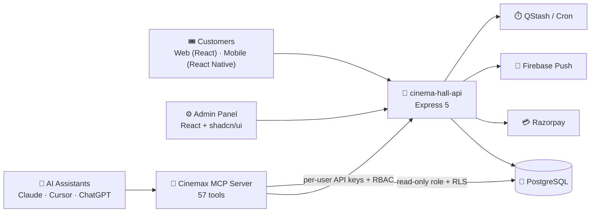

<!-- ============================== HEADER ============================== -->

---

## 👋 About Me

I'm a full stack developer who moved from **banking** into software, with a background in **Instrumentation Engineering**. That shows in how I build: measure first, instrument everything, and make systems that fail safely.

Today I ship end-to-end products across **web, mobile, backend and AI tooling**, from a payments-grade booking platform to an MCP server that lets AI assistants query it.

| | |
|:--|:--|
| 🔭 **Now building** | **ChessReview** — an engine-powered chess game review app (going open source) · **FD/RD Manager** — an offline-first Android app (pre-release) |
| 🤖 **Exploring** | Model Context Protocol (MCP), agentic workflows with Claude Code, local LLMs with Ollama, ComfyUI |
| ⚡ **Strengths** | MERN · TypeScript · React Native · PostgreSQL · RBAC · payments · background jobs · automated reporting |
| 🎯 **Goal** | High-performance systems that solve real-world problems, with AI as a first-class interface |

---

## 🚀 Featured Projects

### ♟️ ChessReview &nbsp;  

> Import your games, run **Stockfish** analysis through a background worker queue, and browse a move-by-move review.

- ⚙️ **Architecture:** Express API + **BullMQ** worker pool + Postgres + Redis, fully containerised with Docker Compose
- 🧠 **Engine:** Stockfish 19, run server-side in workers and in the browser (WASM build) for instant client-side analysis
- 🎨 **Frontend:** React 19, Tailwind CSS 4, shadcn/ui, with Lichess piece sets, board themes and opening (ECO) data
- 🔐 **Backend hardening:** JWT auth, Helmet, Redis-backed rate limiting, Zod validation, structured Pino logging
- 🌍 **Plan:** release under **AGPL-3.0**. The repo is currently private while I get it ready for open source.

`React 19` `Tailwind 4` `Node 20` `Express` `Prisma` `BullMQ` `Redis` `PostgreSQL` `Stockfish` `Docker`

 

### 🎬 CineMax — Full Cinema Booking Platform

A complete, multi-surface product: **customer web app, admin panel, REST API, mobile app, and an AI/MCP server**, all sharing one backend.

| Component | What it is | Highlights | Links |
|:--|:--|:--|:--|
| 📱 **CineMax Mobile** | React Native (New Architecture) booking app, Android + iOS | End-to-end flow to a **QR ticket**, Razorpay in WebView, dark/light theme, pinch-zoom seat map, Google Sign-In, mock-first dev | [Repo](https://github.com/hduraimurugan/ciemax-app) |
| 🌐 **Customer Web App** | React 19 + Vite + Tailwind 4 | Location-aware showtimes, live seat grid, **5-min server-side seat hold** with countdown, coupons, QR/PNG tickets, refund tracking | [Repo](https://github.com/hduraimurugan/cinema-hall-users) |
| 🛠️ **Admin Panel** | React 19 + shadcn/ui + Recharts + Leaflet | Multi-hall workspace, **drag-and-design seat layout canvas**, bulk show scheduler, camera **QR ticket validator**, RBAC, notifications, API keys | [Repo](https://github.com/hduraimurugan/cinema-hall-admin) |
| 🧩 **Backend API** | Express 5 + PostgreSQL | Razorpay verification + atomic webhooks + refunds, idempotency, seat-hold TTL release, Sentry, **352 passing tests** (Vitest + Supertest) | [Repo](https://github.com/hduraimurugan/cinema-hall-api) |
| 🤖 **MCP Server** | Model Context Protocol (Node) | **57 tools** across 9 domains, per-person API keys that inherit real permissions, Postgres **Row-Level Security**, confirm-gated write tools, stdio + HTTP transports | 🔒 Private |
| 📚 **Docs** | Architecture & API docs | Endpoint reference, test inventory, flow diagrams | [Repo](https://github.com/hduraimurugan/cinema-app-docs) |

<b>📸 CineMax mobile screenshots</b>

 

  
  
  
  
  

<b>🖥️ Admin panel screenshots</b>

 

  
  
  
  

 

### 💰 FD/RD Manager &nbsp;  

> Track **Fixed Deposits & Recurring Deposits** with no backend, no ads, no account, and no `INTERNET` permission.

- 📊 Portfolio overview, payout & maturity timeline, and standalone FD/RD calculators
- 🔔 On-device maturity reminders (1/3/7/14 days before)
- 🔐 PIN + biometric app lock (PBKDF2-SHA256) and **AES-256-GCM encrypted backups**
- 🧮 "Derive, don't store" design: maturity values are always recomputed from the real current date
- 📦 **Releasing soon** as a signed open-source APK

`React Native 0.87` `TypeScript` `SQLite (op-sqlite)` `Notifee` `@noble/ciphers`

<b>🗂️ Earlier work</b>

 

- **Military Assets Management System** — secure defense-inventory tracking with RBAC and a **cron-scheduled** daily audit/sync (React, Node, Express, MongoDB, Tailwind) · [Frontend](https://github.com/hduraimurugan/military-management-FE) · [Backend](https://github.com/hduraimurugan/military-BE)
- **College Placement Portal** — MERN platform with Redux-managed student and recruiter dashboards
- **X (Twitter) Clone** — social app using React Query for server-state management · [Repo](https://github.com/hduraimurugan/twitter-clone-app)

---

## 🛠️ Tech Stack

**Frontend & Mobile** 

 

**Backend & Data** 

 

**DevOps, Testing & Tools** 

 

### 🤖 AI & Agentic Engineering

| Focus | What I work with |
|:--|:--|
| **Model Context Protocol** | Designing and shipping a production-style **MCP server** (57 tools, RBAC-aware, RLS-backed, stdio + HTTP) so AI assistants can safely query real business data |
| **AI-assisted development** |  agentic coding workflows, **Playwright MCP** for browser-driven verification, AI design prototypes turned into shipped UIs |
| **Local & open models** |  local LLM experiments ·  node-based image-generation pipelines |
| **AI-safe tool design** | Permission-gated tools, `confirm: true` write guards, read-only DB roles, per-user revocable API keys, and audit logging for agent actions |
| **Engine-driven analysis** | Stockfish (UCI engine) integration, in-browser WASM and server-side worker queues, in ChessReview |

---

## 📊 GitHub Analytics

  
  

  

<!-- Generated by .github/workflows/snake.yml and served from the `output` branch of this repo -->

  <picture>
    <source media="(prefers-color-scheme: dark)" srcset="https://raw.githubusercontent.com/hduraimurugan/hduraimurugan/output/github-snake-dark.svg" />
    <source media="(prefers-color-scheme: light)" srcset="https://raw.githubusercontent.com/hduraimurugan/hduraimurugan/output/github-snake.svg" />
    
  </picture>

#### 📌 Public repositories

  
  
  
  

---

## 🗺️ Roadmap

- [x] CineMax platform: web, admin, API, mobile, MCP server
- [ ] 🚧 Ship **ChessReview** and open-source it under AGPL-3.0
- [ ] 📦 Release **FD/RD Manager** as a signed Android APK
- [ ] 🔌 Extend the Cinemax MCP server with `prepare_` / `confirm_` write workflows

---

## 🌐 Connect with Me

  
  
  

